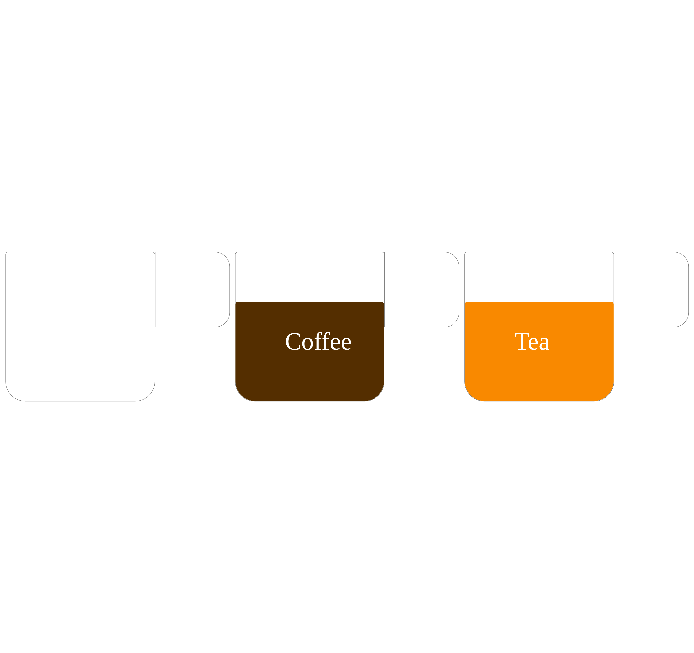
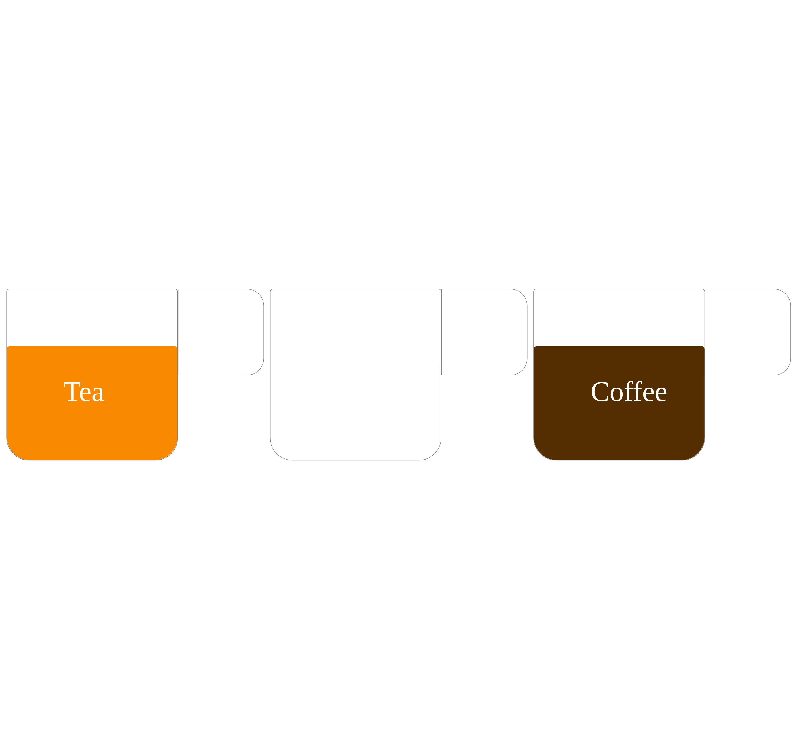
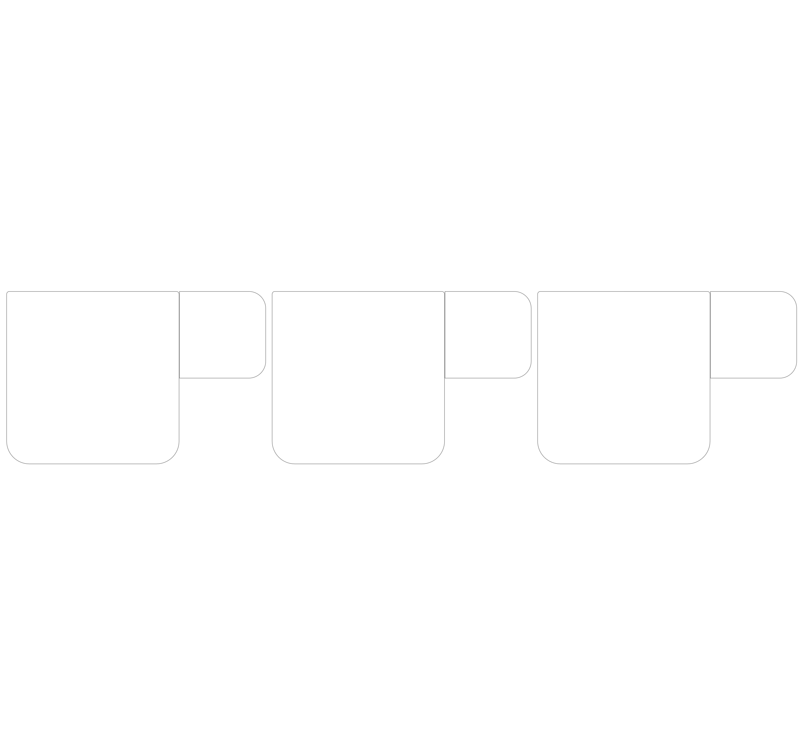

# Pindah isi

## hasil 

## cara kerja

1. jadi ketika gelas kosong di klik sekali maka gelas kosong berubah menjadi kopi
2. lalu ketika gelas yg berisi kopi diklik sekali maka gelas kopi berubah menjadi teh
3. ketika gelas yg berisi teh di klik maka gelas berubah menjadi kosong
